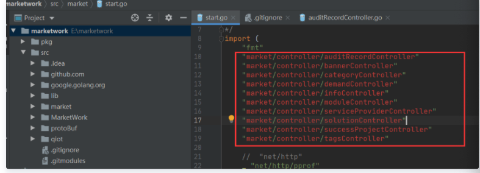
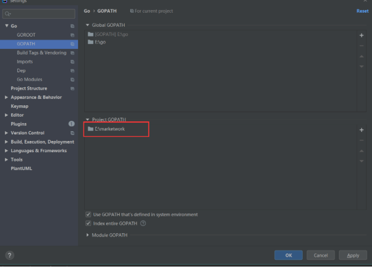

# Go 命令行工具
`go xxx`

# 代码组织
go 程序被组织成包

# 模块
一系列相关的Go包，放到一个目录里，就组成了一个模块

github go项目仓库中，**通常只包含一个模块**，但其实多个也可以的。

**在每个模块的根目录中要放置他的 go.mod 文件**

```
- module
    - package0
        - file1.go
        - file2.go
    - package1
        - ...
    - package2
        - ...
    - go.mod
```

# go.mod 内容

```
module github.com/xxx/asd      // 第一行，该模块的模块路径(包名)

go 1.5          // 第二行，go版本

require (       // 依赖包及版本
    github.com/satori/go.uuid v1.2.0
	google.golang.org/appengine v1.6.1 // indirect   // indirect 表示间接引用
)
```

# demo
创建模块
```sh
cd hello
go mod init example/user/hello
```

然后会产生 go.mod 文件。接下来创建 hello.go 里写 Hello World（注意 package main ）不要丢
```
    - hello
        - hello.go
        - go.mod
```

进行编译安装，`go install example/user/hello`，将模块编译成叫 hello 的二进制文件 并安装在了家目录的go/bin/里 `ll ~/go/bin/hello`

你可以通过更改 GOPATH 和 GOBIN 两个环境变量来自定义安装的位置。如果设置GOPATH会安装到GOPATH列表中第一个目录的bin子目录，如果设置GOBIN则会直接安装到GOBIN中

设置值：`go env -w  GOBIN=/somewhere`   恢复出厂设置：`go env -u`


go install 注意地方：如果你当前工作目录不在 example/user/hello 模块里面，go install 命令会执行失败。如果你工作目录在模块中，`go install example/user/hello`, `go install .`, `go install` 三条命令等价

继续在 hello 模块里添加 morestrings 包(创建此文件夹)，创建 reverse.go 文件，在里面编写函数实现字符串反转操作。
reverse.go 内容：
```go
// Package morestrings xxxx
package morestrings


// ReverseRunes retures xxx
func ReverseRunes(s string) string {
	r := []rune(s)
	for i,j := 0,len(r)-1; i < len(r)/2; i,j = i+1,j-1 {
        r[i], r[j] = r[j], r[i]
	}
	return string(r)
}
```

然后 `go build`，什么也没有发生？不，只有 main 包的 main 函数可以编译出可执行文件。严格来说，这个包还是被编译的了，编译结果被放在了本地的编译缓存中，方便以后取用，而且 `go build` 没报错说明包中没有编译的错误，可以通过这种办法简单验证自己写的代码有没有语法问题。

接下来可在 main 包(hello.go)中调用这个新写的东西了。
```go
package main

import (
	"example/user/hello/morestrings"
	"fmt"
)

func main() {
	fmt.Println(morestrings.ReverseRunes("Hello World"))
}
```


# 远程包
依赖包在 go.mod 文件的 require 中，使用方法直接 import 即可。

`go mod tidy` 该命令会自动安装满足依赖。依赖的远程包会自动下载到 `$GOPATH/pkg/`，全是只读文件

移除下载：`go clean -modcache`

镜像代理：`go env -w GO111MODULE=on`  `go env -w GOPROXY=https://goproxy.cn,direct`，设置完成之后最好在重启一下终端，如果出警告设置之前先执行`unset GOPROXY`


# GO项目维护
有两种模式，一个是 GO MODULE(go mod)模式，另一种是 GO PATH(go path) 模式。新项目基本全是 GO MODULE 模式，老项目有些是 GO PATH 模式。

## 全局环境路径
### GOROOT
- goroot/src 下是go本身的包
- go mod 模式下，gopath/pkg/mod/ 找不到的包会从 goroot/src 下面找
- go path 模式下，gopath/src/ 里面不存在的包也会从 goroot/src 下面找

## GOPATH
- 无论是 go mod 还是 go path 模式，此目录需要有
- go mod 模式，第三方依赖包会安装在 gopath/pkg/mod 下
- go path 模式，第三方依赖包会安装在 gopath/src 下


## go path 模式冲突
go mod 的代码可以随意安放，它指定了包名，依赖包都在此包名下，不会冲突。

go path diamante都放在 gopath/src 下，如果两个项目，都有同一个包，代码混在一起.....


### 本地依赖包冲突
将代码克隆到任意目录，发现本地依赖的包有问题，因为都从全局的 gopath/src 去包含了，而你的代码不在 gopath/src 下



解决方法：设置项目的 go path




### github 依赖包冲突
直接 go get，你会发现下载在当前项目目录下 gopath/src下，这对本项目是没什么的，因为全局 gopath和 goroot 找不到，还会到项目 gopath 去找。

解决方式直接开新终端去下在，就会下载到全局 gopath/src 下面了

# 依赖包到项目目录下

vender 机制：go在1.5之后开始支持，查找某依赖包，会现在项目根目录下的 vender 文件夹中查找，如果找不到就去 gopath/src 目录下找

命令 `go vendor` 能将所有依赖导出到 vendor 下！！！


# 测试
写 `xxx_test.go` 文件，导入 testing，测试函数 TestXxx(t *testing.T)，设置好一些输入输出用例，没通过就`t.Error()`或`t.Fail()`

reverse_test.go
```go
package morestrings

import "testing"

func TestReverseRunes(t *testing.T)  {
	cases := []struct{
		in, want string
    } {
		{"aaa", "aaa"},
		{"abc", "cba"},
    }
	for _, c := range cases {
        got := ReverseRunes(c.in)
		if got != c.want {
			t.Errorf("ReverseRunes(%q) == %q, want %q", c.in, got, c.want)
        }
	}
}
```